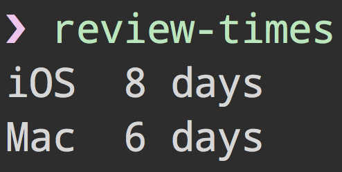

# review-times [](https://travis-ci.org/sindresorhus/review-times)

> Get the average review times for the iOS & macOS App Store - provided by [appreviewtimes.com](http://appreviewtimes.com)


## CLI



```
$ npm install --global review-times
```

```
$ review-times --help

  Example
    $ review-times
    iOS    8 days
    macOS  6 days
```


## API

```
$ npm install --save review-times
```

```js
const reviewTimes = require('review-times');

reviewTimes.then(times => {
	console.log(times);
	//=> {ios: 8, macos: 6}
	//         ^ days
});
```


## License

MIT © [Sindre Sorhus](http://sindresorhus.com)
